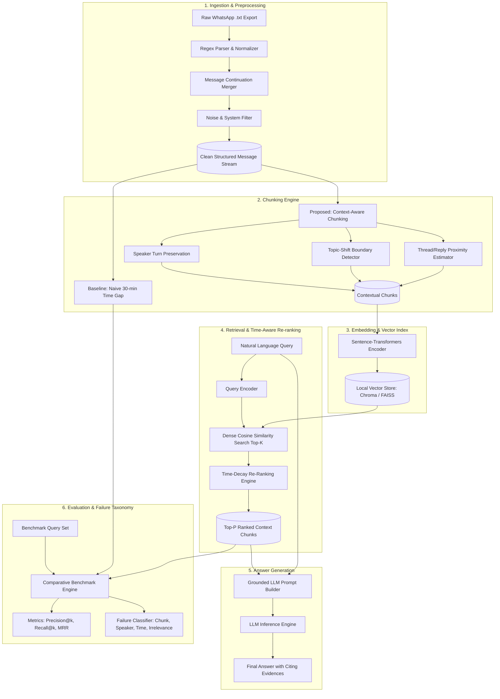

# System Design Document: Context-Aware Conversational Retrieval Framework

**Document Version**: 1.0.0  
**Project Title**: Retrieval Beyond Text: Designing a Context-Aware Retrieval Framework for Multi-Party, Time-Dependent Conversations  
**Academic Year**: 2026–2027 | B.Tech CSE Phase II  
**Institution**: Amrita School of Computing, Amritapuri Campus, Amrita Vishwa Vidyapeetham  
**Target SDG**: SDG 9 (Industry, Innovation, and Infrastructure)

---

## 1. Architectural Overview & Design Goals

### 1.1 The Fundamental Design Challenge
Generic Retrieval-Augmented Generation (RAG) frameworks (e.g., LangChain, LlamaIndex, Haystack) and conversational memory systems (e.g., MemGPT, SECOM) rely on assumptions that fail when applied to real-world multi-party human messaging:

| Dimension | Generic Document RAG | Multi-Party Human Chat (WhatsApp) | Design Impact in Our Framework |
| :--- | :--- | :--- | :--- |
| **Information Granularity** | Paragraphs, sections, headers | Short, fragmented messages (*"Yeah"*, *"Tomorrow"*) | Turn-aggregation & context expansion |
| **Speaker Attribution** | Single or anonymous author | Multiple interleaved human speakers | Explicit speaker tracking inside chunks |
| **Topic Coherence** | Uniform within sections | Rapid topic drift without punctuation/headers | Semantic boundary & topic-shift detection |
| **Temporal Dynamics** | Static or chronological publish date | Temporal validity changes (*Jan: "React"* $\rightarrow$ *Aug: "Flutter"*) | Time-weighted exponential decay re-ranking |
| **Privacy Constraints** | Ingestion into cloud vector services | Intimate personal conversations | On-device, local-first vector indexing |

### 1.2 System Pipeline Diagram



---

## 2. Detailed Data Schemas

### 2.1 Structured Message Record (`MessageRecord`)
The raw text export from WhatsApp (iOS and Android formats) is parsed into uniform message objects:

```json
{
  "$schema": "http://json-schema.org/draft-07/schema#",
  "title": "MessageRecord",
  "type": "object",
  "properties": {
    "message_id": { "type": "string", "description": "Unique deterministic hash or sequential ID" },
    "timestamp": { "type": "string", "format": "date-time", "description": "ISO 8601 timestamp" },
    "date": { "type": "string", "format": "date", "description": "YYYY-MM-DD" },
    "time": { "type": "string", "description": "HH:MM:SS (24-hour format)" },
    "sender": { "type": "string", "description": "Sender phone number or display name" },
    "text": { "type": "string", "description": "Cleaned message payload" },
    "is_system": { "type": "boolean", "description": "True if message is a WhatsApp system event" },
    "has_media": { "type": "boolean", "description": "True if message contained media omitted" },
    "char_count": { "type": "integer" },
    "word_count": { "type": "integer" }
  },
  "required": ["message_id", "timestamp", "sender", "text", "is_system"]
}
```

### 2.2 Conversational Chunk (`ConversationChunk`)
Represents an aggregated segment designed for vector embedding and retrieval:

```json
{
  "$schema": "http://json-schema.org/draft-07/schema#",
  "title": "ConversationChunk",
  "type": "object",
  "properties": {
    "chunk_id": { "type": "string" },
    "strategy": { "type": "string", "enum": ["naive_time_gap", "context_aware", "sliding_window"] },
    "start_timestamp": { "type": "string", "format": "date-time" },
    "end_timestamp": { "type": "string", "format": "date-time" },
    "reference_timestamp": { "type": "string", "format": "date-time", "description": "Anchor timestamp for time-decay calculations (usually end_timestamp)" },
    "message_ids": { "type": "array", "items": { "type": "string" } },
    "participants": { "type": "array", "items": { "type": "string" } },
    "raw_text": { "type": "string", "description": "Plain concatenated message text" },
    "attributed_text": { 
      "type": "string", 
      "description": "Structured multi-turn dialogue: [YYYY-MM-DD HH:MM] Sender: Message" 
    },
    "topic_label": { "type": "string", "description": "Optional inferred topic or keywords" },
    "metadata": {
      "type": "object",
      "properties": {
        "message_count": { "type": "integer" },
        "timespan_seconds": { "type": "number" },
        "turn_count": { "type": "integer" }
      }
    }
  },
  "required": ["chunk_id", "strategy", "start_timestamp", "end_timestamp", "attributed_text", "participants"]
}
```

---

## 3. Mathematical Formulation & Core Algorithms

### 3.1 Time-Weighted Retrieval Re-ranking
Given a query $q$ and a set of candidate retrieved conversational chunks $C = \{c_1, c_2, \dots, c_K\}$, the combined ranking score $\text{Score}(q, c)$ balances semantic relevance and temporal freshness:

$$\text{Score}(q, c) = \alpha \cdot S_{\text{semantic}}(q, c) + (1 - \alpha) \cdot T_{\text{decay}}(t_q, t_c, \lambda)$$

Where:
1. **Semantic Similarity**:
   $$S_{\text{semantic}}(q, c) = \frac{\mathbf{e}_q \cdot \mathbf{e}_c}{\|\mathbf{e}_q\| \|\mathbf{e}_c\|} \in [0, 1]$$
   where $\mathbf{e}_q, \mathbf{e}_c$ are dense vector embeddings generated by the embedding model.

2. **Time Decay Function**:
   $$T_{\text{decay}}(t_q, t_c, \lambda) = \exp\left(-\lambda \cdot \frac{\Delta t(c)}{\Delta t_{\max}}\right)$$
   where:
   - $\Delta t(c) = |t_{\text{ref}} - t_c|$ is the elapsed time between the reference anchor $t_{\text{ref}}$ (current time or explicit query target time) and chunk timestamp $t_c$.
   - $\Delta t_{\max} = \max_{c' \in C} \Delta t(c')$ normalizes time across the candidate set.
   - $\lambda \ge 0$ is the time decay sensitivity hyperparameter.
   - $\alpha \in [0, 1]$ is the user-tunable weight governing the trade-off between pure semantic similarity and recency.

#### Hyperparameter Regimes:
- **$\alpha = 1.0$**: Pure traditional semantic search (no temporal awareness).
- **$\alpha = 0.5, \lambda = 1.0$**: Balanced context-aware conversational retrieval.
- **$\alpha = 0.2, \lambda = 2.0$**: Strong recency preference (ideal for *"What was our latest decision?"*).

---

### 3.2 Context-Aware Chunking Algorithm

```python
"""
Algorithm: Topic & Speaker-Aware Conversational Chunking
Input: Sorted Message Records M = [m_1, m_2, ..., m_N]
Parameters:
  - tau_time: Maximum allowable inactivity gap (e.g. 20 minutes)
  - tau_topic: Cosine similarity threshold for topic shift (e.g. 0.42)
  - max_messages: Maximum chunk message capacity (e.g. 15)
  - min_messages: Minimum chunk message threshold (e.g. 3)
"""

def context_aware_chunking(messages, tau_time, tau_topic, max_messages, min_messages):
    chunks = []
    current_chunk = []
    
    for i in range(len(messages)):
        msg = messages[i]
        
        if not current_chunk:
            current_chunk.append(msg)
            continue
            
        prev_msg = current_chunk[-1]
        time_diff = msg.timestamp - prev_msg.timestamp
        
        # 1. Temporal boundary condition
        is_time_split = time_diff > tau_time
        
        # 2. Semantic topic boundary condition
        is_topic_split = False
        if len(current_chunk) >= min_messages:
            window_a_text = " ".join([m.text for m in current_chunk[-3:]])
            window_b_text = msg.text
            sim = compute_semantic_similarity(window_a_text, window_b_text)
            if sim < tau_topic:
                is_topic_split = True
                
        # 3. Capacity condition
        is_overflow = len(current_chunk) >= max_messages
        
        if is_time_split or is_topic_split or is_overflow:
            chunks.append(build_chunk(current_chunk))
            current_chunk = [msg]
        else:
            current_chunk.append(msg)
            
    if current_chunk:
        chunks.append(build_chunk(current_chunk))
        
    return chunks
```

---

## 4. Evaluation & Failure Taxonomy

The central research contribution is a diagnostic framework analyzing why generic RAG fails on chat data.

### 4.1 Diagnostic Failure Taxonomy

```text
                                  Retrieval Errors
                                          │
    ┌──────────────────────┬──────────────┴───────────────┬──────────────────────┐
    ▼                      ▼                              ▼                      ▼
[Type I: Boundary]    [Type II: Speaker]           [Type III: Temporal]   [Type IV: Semantic]
Relevant messages     Evidence retrieved,          Old superseded         Generic lexical
split into different  but speaker attribution      decision retrieved     match with zero
unrelated chunks      lost (unknown author)        over latest update     task relevance
```

1. **Type I: Bad Chunk Boundary**: Evidence is severed across consecutive chunks or buried in a 200-message chunk where embedding is diluted.
2. **Type II: Lost Speaker Context**: The chunk contains the factual statement (*"I will bring the documents"*), but omits the speaker attribution, causing the LLM to hallucinate the owner.
3. **Type III: Wrong Time Window**: Retrieval returns an earlier discussion (*"Let's use React"*) rather than a subsequent reversal (*"We changed to Flutter"*).
4. **Type IV: Irrelevant Retrieval**: False positive matches caused by code-mixed slang, greetings, or short ambiguous replies.

### 4.2 Benchmark Metrics
- **Hit Rate@k**: Fraction of test queries where ground-truth evidence chunk is in the top-$k$.
- **Mean Reciprocal Rank (MRR)**: Average reciprocal rank of the first relevant chunk.
- **Attribution Accuracy**: Proportion of questions where the speaker of the action is correctly identified.
- **Temporal Correctness**: Proportion of time-sensitive queries returning the chronologically valid decision.

---

## 5. Security & Privacy Architecture
1. **Local-First Boundary**: Raw `.txt` WhatsApp logs and generated SQLite vector indices remain on the user's local disk.
2. **No Persistent Cloud Uploads**: The pipeline does not store chat content in external vector SaaS databases.
3. **Data Anonymization Utility**: Built-in regex module for masking phone numbers, personal identifiers, and email addresses prior to embedding.
